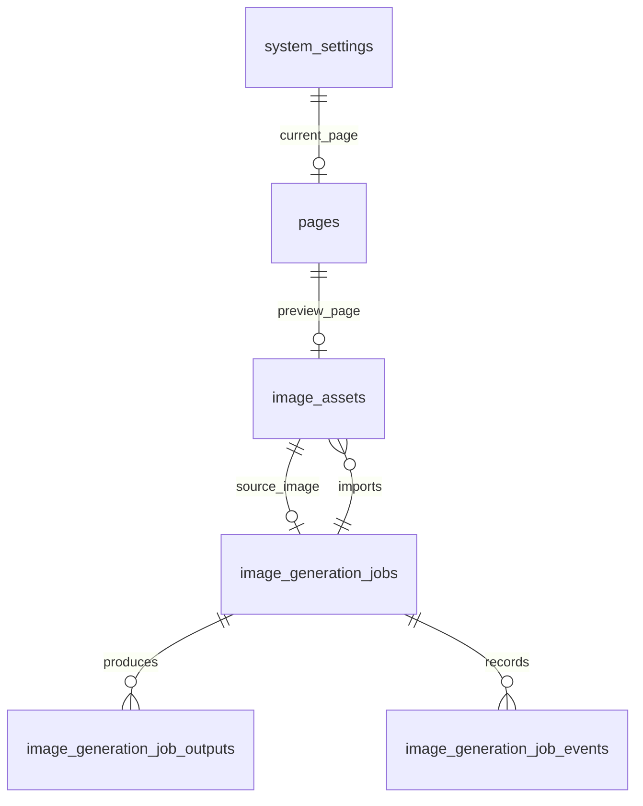

# AI 生图数据库设计

## 目标

基于 [`AI生图架构.md`](./AI生图架构.md) 的任务制方案，补充一套可落地的关系型数据库设计，用于替代当前仅靠 JSON 文件保存任务元数据的方式。

本设计的目标不是把图片二进制存进数据库，而是把以下元数据持久化：

- AI 生图任务
- Provider 远端任务映射
- 生图输出结果与导入记录
- 图片资产元数据
- 页面元数据
- 当前展示页面状态
- 任务状态流转审计

## 设计结论

推荐数据库：PostgreSQL 16+

原因：

- 支持事务，适合任务状态流转和幂等导入
- 支持 `jsonb`，便于保存 Provider 原始响应与调试字段
- 索引能力成熟，适合任务列表、状态筛选、时间排序
- 后续如果要增加多 Provider、多模型配置和审计查询，可持续演进

存储边界建议：

- 数据库保存元数据
- 图片原文件继续保存在 `data/images/` 或对象存储
- 页面 HTML 继续保存在 `data/pages/` 或对象存储
- 数据库仅保存文件路径、访问 URL、哈希、大小等描述信息

## 与当前仓库的关系

当前仓库的元数据主要存放在：

- `data/config.json`
- `data/images.json`

建议数据库化后做如下映射：

| 当前存储 | 目标表 |
|------|------|
| `config.currentPageId` | `system_settings.current_page_id` |
| `config.pages[]` | `pages` |
| `images.json.images[]` | `image_assets` |
| `image-generation-jobs.json` | `image_generation_jobs` 等 AI 生图表 |

这样可以保持现有“文件保存内容、元数据单独管理”的模式不变，只把元数据管理方式从 JSON 升级为数据库。

## 设计原则

- 任务域与资产域分离：任务推进和图片资产入库分别建模
- 面向扩展：第一阶段只接入 ModelScope，但表结构不绑定单一 Provider
- 幂等优先：重复查询、重复同步、服务重启后恢复都不能造成重复导入
- 审计优先：状态变化、Provider 错误、导入失败都要可追踪
- 低耦合：不把图片文件内容塞进数据库，避免数据库膨胀

## 逻辑模型



说明：

- `pages` 保存展示页元数据
- `image_assets` 保存图片资产元数据
- `image_generation_jobs` 保存 AI 生图任务
- `image_generation_job_outputs` 保存远端返回的每一张结果图
- `image_generation_job_events` 保存状态流转和错误审计
- `system_settings` 保存当前展示页面等全局状态

## ID 设计

建议所有业务主键使用应用侧生成的 ULID 字符串：

- 长度固定，按时间有序，便于列表排序
- 避免数据库方言相关的自增主键实现差异
- 便于继续沿用当前 API 里“字符串 ID”的风格

推荐格式：

- `pages.id`: `page_` + ULID
- `image_assets.id`: `img_` + ULID
- `image_generation_jobs.id`: `job_` + ULID
- `image_generation_job_outputs.id`: `jout_` + ULID
- `image_generation_job_events.id`: `jevt_` + ULID

## 核心表设计

### 1. `system_settings`

用于替代当前 `config.json` 中的全局配置。

| 字段 | 类型 | 约束 | 说明 |
|------|------|------|------|
| `id` | `smallint` | PK，固定为 `1` | 单行配置表 |
| `current_page_id` | `varchar(32)` | FK -> `pages.id`，可空 | 当前展示页面 |
| `created_at` | `timestamptz` | not null | 创建时间 |
| `updated_at` | `timestamptz` | not null | 更新时间 |

说明：

- 保持单行即可，不建议设计成通用 KV 表
- 当前项目配置项很少，单行表比 KV 更可维护

### 2. `pages`

保存展示页元数据，对应当前 `config.pages[]`。

| 字段 | 类型 | 约束 | 说明 |
|------|------|------|------|
| `id` | `varchar(32)` | PK | 页面 ID |
| `name` | `varchar(200)` | not null | 页面名称 |
| `source_type` | `varchar(32)` | not null | `manual_html` / `image_asset` |
| `storage_path` | `text` | not null | HTML 文件相对路径或对象存储 key |
| `content_hash` | `varchar(64)` | 可空 | HTML 内容哈希，便于去重与审计 |
| `created_by` | `varchar(64)` | 可空 | 创建者，当前可先留空 |
| `created_at` | `timestamptz` | not null | 创建时间 |
| `updated_at` | `timestamptz` | not null | 更新时间 |
| `deleted_at` | `timestamptz` | 可空 | 软删除时间 |

索引建议：

- `idx_pages_created_at` on `created_at desc`
- `idx_pages_source_type_created_at` on `(source_type, created_at desc)`

说明：

- `storage_path` 对应当前 `data/pages/<filename>.html`
- 如果未来切换对象存储，无需改业务关系，只改文件访问层

### 3. `image_assets`

保存图库元数据，对应当前 `images.json.images[]`，并承接 AI 生图结果。

| 字段 | 类型 | 约束 | 说明 |
|------|------|------|------|
| `id` | `varchar(32)` | PK | 图片资产 ID |
| `name` | `varchar(200)` | not null | 图片名称 |
| `filename` | `varchar(255)` | not null | 文件名 |
| `storage_path` | `text` | not null | 图片文件相对路径或对象存储 key |
| `mime_type` | `varchar(100)` | not null | MIME 类型 |
| `size_bytes` | `bigint` | not null | 文件大小 |
| `sha256` | `varchar(64)` | 可空 | 内容哈希 |
| `width` | `integer` | 可空 | 图片宽度 |
| `height` | `integer` | 可空 | 图片高度 |
| `source` | `varchar(32)` | not null | `upload` / `ai_generated` |
| `page_id` | `varchar(32)` | FK -> `pages.id`，可空 | 关联展示页 |
| `generation_job_id` | `varchar(32)` | FK -> `image_generation_jobs.id`，可空 | 来源任务 |
| `generation_output_id` | `varchar(32)` | FK -> `image_generation_job_outputs.id`，可空 | 来源输出 |
| `generator_provider` | `varchar(32)` | 可空 | 如 `modelscope` |
| `generator_model` | `varchar(120)` | 可空 | 模型标识 |
| `prompt` | `text` | 可空 | prompt 快照 |
| `negative_prompt` | `text` | 可空 | negative prompt 快照 |
| `created_at` | `timestamptz` | not null | 创建时间 |
| `updated_at` | `timestamptz` | not null | 更新时间 |
| `deleted_at` | `timestamptz` | 可空 | 软删除时间 |

索引建议：

- `idx_image_assets_created_at` on `created_at desc`
- `idx_image_assets_source_created_at` on `(source, created_at desc)`
- `idx_image_assets_generation_job_id` on `generation_job_id`
- `idx_image_assets_page_id` on `page_id`
- `uniq_image_assets_page_id` unique on `page_id` where `page_id is not null`
- `uniq_image_assets_generation_output_id` unique on `generation_output_id`

说明：

- `generation_output_id` 设为唯一，可防止同一远端输出被重复导入
- `prompt` 等字段保留快照，避免图片列表页强依赖任务表联查

### 4. `image_generation_jobs`

AI 生图任务主表，是整个任务域的核心。

| 字段 | 类型 | 约束 | 说明 |
|------|------|------|------|
| `id` | `varchar(32)` | PK | 本地任务 ID |
| `provider` | `varchar(32)` | not null | 当前为 `modelscope` |
| `mode` | `varchar(32)` | not null | `text_to_image` / `image_to_image` |
| `status` | `varchar(32)` | not null | 任务状态 |
| `name` | `varchar(200)` | not null | 任务名 |
| `prompt` | `text` | not null | 正向提示词 |
| `negative_prompt` | `text` | 可空 | 负向提示词 |
| `model` | `varchar(120)` | not null | 模型标识 |
| `size` | `varchar(32)` | 可空 | 如 `1024x1024` |
| `seed` | `bigint` | 可空 | 种子 |
| `steps` | `integer` | 可空 | 采样步数 |
| `guidance` | `numeric(6,2)` | 可空 | 引导强度 |
| `source_image_asset_id` | `varchar(32)` | FK -> `image_assets.id`，可空 | 图生图源图 |
| `remote_task_id` | `varchar(128)` | 可空 | Provider 任务 ID |
| `remote_request_id` | `varchar(128)` | 可空 | Provider 请求 ID |
| `status_reason` | `varchar(64)` | 可空 | 失败或终止原因码 |
| `error_message` | `text` | 可空 | 脱敏后的错误信息 |
| `sync_attempts` | `integer` | not null default `0` | 同步次数 |
| `last_synced_at` | `timestamptz` | 可空 | 最后同步时间 |
| `next_sync_at` | `timestamptz` | 可空 | 下次允许同步时间 |
| `submitted_at` | `timestamptz` | 可空 | 远端提交完成时间 |
| `processing_started_at` | `timestamptz` | 可空 | 进入处理时间 |
| `completed_at` | `timestamptz` | 可空 | 终态时间 |
| `version` | `integer` | not null default `0` | 乐观锁版本号 |
| `provider_request_payload` | `jsonb` | 可空 | 发给 Provider 的快照 |
| `provider_response_payload` | `jsonb` | 可空 | 最近一次查询快照 |
| `created_at` | `timestamptz` | not null | 创建时间 |
| `updated_at` | `timestamptz` | not null | 更新时间 |
| `deleted_at` | `timestamptz` | 可空 | 软删除时间，通常不删 |

状态建议：

- `queued`
- `submitted`
- `processing`
- `succeeded`
- `failed`
- `timed_out`
- `canceled`
- `import_failed`

索引建议：

- `idx_ig_jobs_status_created_at` on `(status, created_at desc)`
- `idx_ig_jobs_provider_status_created_at` on `(provider, status, created_at desc)`
- `idx_ig_jobs_next_sync_at` on `next_sync_at`
- `idx_ig_jobs_created_at` on `created_at desc`
- `uniq_ig_jobs_provider_remote_task_id` unique on `(provider, remote_task_id)` where `remote_task_id is not null`

说明：

- `provider_request_payload` 和 `provider_response_payload` 只用于调试和审计，业务逻辑不能依赖 JSON 结构
- `version` 用于并发更新保护，避免多个请求同时推进同一任务

### 5. `image_generation_job_outputs`

远端任务可能返回多张图，因此输出结果必须独立建表，而不是只在任务表里放一个 `importedImageId`。

| 字段 | 类型 | 约束 | 说明 |
|------|------|------|------|
| `id` | `varchar(32)` | PK | 输出记录 ID |
| `job_id` | `varchar(32)` | FK -> `image_generation_jobs.id` | 所属任务 |
| `output_index` | `integer` | not null | 结果序号，从 `0` 开始 |
| `remote_url` | `text` | not null | Provider 返回的图片地址 |
| `remote_url_hash` | `varchar(64)` | not null | 远端 URL 哈希，辅助幂等 |
| `status` | `varchar(32)` | not null | `pending_import` / `imported` / `import_failed` |
| `image_asset_id` | `varchar(32)` | FK -> `image_assets.id`，可空 | 导入后的本地图片资产 |
| `page_id` | `varchar(32)` | FK -> `pages.id`，可空 | 导入后关联页面 |
| `error_message` | `text` | 可空 | 导入失败信息 |
| `imported_at` | `timestamptz` | 可空 | 导入完成时间 |
| `created_at` | `timestamptz` | not null | 创建时间 |
| `updated_at` | `timestamptz` | not null | 更新时间 |

索引建议：

- `uniq_ig_job_outputs_job_id_output_index` unique on `(job_id, output_index)`
- `idx_ig_job_outputs_job_id` on `job_id`
- `idx_ig_job_outputs_status_created_at` on `(status, created_at desc)`
- `uniq_ig_job_outputs_image_asset_id` unique on `image_asset_id` where `image_asset_id is not null`

说明：

- 同一任务的第 `N` 张结果图只允许导入一次
- `remote_url_hash` 用于辅助去重，但真正的幂等锚点建议仍然用 `generation_output_id`

### 6. `image_generation_job_events`

任务状态审计表，用于排查问题、记录状态机流转，也可为后续后台事件流提供基础。

| 字段 | 类型 | 约束 | 说明 |
|------|------|------|------|
| `id` | `varchar(32)` | PK | 事件 ID |
| `job_id` | `varchar(32)` | FK -> `image_generation_jobs.id` | 所属任务 |
| `event_type` | `varchar(64)` | not null | 事件类型 |
| `from_status` | `varchar(32)` | 可空 | 迁移前状态 |
| `to_status` | `varchar(32)` | 可空 | 迁移后状态 |
| `message` | `text` | 可空 | 事件说明 |
| `payload` | `jsonb` | 可空 | 脱敏后的辅助信息 |
| `created_at` | `timestamptz` | not null | 事件时间 |

事件类型建议：

- `job_created`
- `job_submitted`
- `job_processing`
- `job_succeeded`
- `job_failed`
- `job_timed_out`
- `job_canceled`
- `job_import_failed`
- `job_output_imported`

索引建议：

- `idx_ig_job_events_job_id_created_at` on `(job_id, created_at desc)`
- `idx_ig_job_events_event_type_created_at` on `(event_type, created_at desc)`

## 推荐 SQL DDL

以下 SQL 以 PostgreSQL 为目标，采用 `varchar + check` 而不是数据库 enum，便于后续扩展状态值。

```sql
create table system_settings (
  id smallint primary key default 1 check (id = 1),
  current_page_id varchar(32) null,
  created_at timestamptz not null default now(),
  updated_at timestamptz not null default now()
);

create table pages (
  id varchar(32) primary key,
  name varchar(200) not null,
  source_type varchar(32) not null check (source_type in ('manual_html', 'image_asset')),
  storage_path text not null,
  content_hash varchar(64) null,
  created_by varchar(64) null,
  created_at timestamptz not null default now(),
  updated_at timestamptz not null default now(),
  deleted_at timestamptz null
);

create table image_generation_jobs (
  id varchar(32) primary key,
  provider varchar(32) not null,
  mode varchar(32) not null check (mode in ('text_to_image', 'image_to_image')),
  status varchar(32) not null check (
    status in ('queued', 'submitted', 'processing', 'succeeded', 'failed', 'timed_out', 'canceled', 'import_failed')
  ),
  name varchar(200) not null,
  prompt text not null,
  negative_prompt text null,
  model varchar(120) not null,
  size varchar(32) null,
  seed bigint null,
  steps integer null,
  guidance numeric(6,2) null,
  source_image_asset_id varchar(32) null,
  remote_task_id varchar(128) null,
  remote_request_id varchar(128) null,
  status_reason varchar(64) null,
  error_message text null,
  sync_attempts integer not null default 0,
  last_synced_at timestamptz null,
  next_sync_at timestamptz null,
  submitted_at timestamptz null,
  processing_started_at timestamptz null,
  completed_at timestamptz null,
  version integer not null default 0,
  provider_request_payload jsonb null,
  provider_response_payload jsonb null,
  created_at timestamptz not null default now(),
  updated_at timestamptz not null default now(),
  deleted_at timestamptz null
);

create unique index uniq_ig_jobs_provider_remote_task_id
  on image_generation_jobs(provider, remote_task_id)
  where remote_task_id is not null;

create table image_assets (
  id varchar(32) primary key,
  name varchar(200) not null,
  filename varchar(255) not null,
  storage_path text not null,
  mime_type varchar(100) not null,
  size_bytes bigint not null check (size_bytes >= 0),
  sha256 varchar(64) null,
  width integer null,
  height integer null,
  source varchar(32) not null check (source in ('upload', 'ai_generated')),
  page_id varchar(32) null,
  generation_job_id varchar(32) null,
  generation_output_id varchar(32) null,
  generator_provider varchar(32) null,
  generator_model varchar(120) null,
  prompt text null,
  negative_prompt text null,
  created_at timestamptz not null default now(),
  updated_at timestamptz not null default now(),
  deleted_at timestamptz null
);

create table image_generation_job_outputs (
  id varchar(32) primary key,
  job_id varchar(32) not null references image_generation_jobs(id),
  output_index integer not null check (output_index >= 0),
  remote_url text not null,
  remote_url_hash varchar(64) not null,
  status varchar(32) not null check (status in ('pending_import', 'imported', 'import_failed')),
  image_asset_id varchar(32) null,
  page_id varchar(32) null,
  error_message text null,
  imported_at timestamptz null,
  created_at timestamptz not null default now(),
  updated_at timestamptz not null default now(),
  unique (job_id, output_index)
);

alter table image_assets
  add constraint fk_image_assets_page
  foreign key (page_id) references pages(id);

alter table image_assets
  add constraint fk_image_assets_generation_job
  foreign key (generation_job_id) references image_generation_jobs(id);

alter table image_assets
  add constraint fk_image_assets_generation_output
  foreign key (generation_output_id) references image_generation_job_outputs(id);

alter table image_generation_jobs
  add constraint fk_ig_jobs_source_image_asset
  foreign key (source_image_asset_id) references image_assets(id);

alter table image_generation_job_outputs
  add constraint fk_ig_job_outputs_image_asset
  foreign key (image_asset_id) references image_assets(id);

alter table image_generation_job_outputs
  add constraint fk_ig_job_outputs_page
  foreign key (page_id) references pages(id);

alter table system_settings
  add constraint fk_system_settings_current_page
  foreign key (current_page_id) references pages(id);

create unique index uniq_image_assets_generation_output_id
  on image_assets(generation_output_id)
  where generation_output_id is not null;

create unique index uniq_image_assets_page_id
  on image_assets(page_id)
  where page_id is not null;

create unique index uniq_ig_job_outputs_image_asset_id
  on image_generation_job_outputs(image_asset_id)
  where image_asset_id is not null;

create table image_generation_job_events (
  id varchar(32) primary key,
  job_id varchar(32) not null references image_generation_jobs(id),
  event_type varchar(64) not null,
  from_status varchar(32) null,
  to_status varchar(32) null,
  message text null,
  payload jsonb null,
  created_at timestamptz not null default now()
);
```

## 并发与幂等设计

### 1. 查询时同步的并发保护

因为架构采用“`GET job` 时推进状态”的模式，必须避免两个请求同时导入同一张图。

建议做法：

- 读取任务时使用事务
- 使用 `select ... for update` 锁住 `image_generation_jobs` 当前行
- 更新任务时带上 `version = version + 1`
- 导入输出时依赖 `image_generation_job_outputs(job_id, output_index)` 唯一约束
- 图片资产入库时依赖 `image_assets.generation_output_id` 唯一约束

结果：

- 同一输出最多导入一次
- 重复刷新页面不会创建重复图片资产
- 服务重启后再次同步仍然安全

### 2. Provider 远端任务唯一性

`(provider, remote_task_id)` 必须唯一。

原因：

- 防止本地出现两个任务都指向同一个 Provider 任务
- 便于排查“重复提交”或“重放提交”的问题

### 3. 终态幂等

以下状态属于终态：

- `succeeded`
- `failed`
- `timed_out`
- `canceled`
- `import_failed`

终态约束建议：

- `completed_at` 不可为空
- `syncJob` 遇到终态直接返回，不再访问 Provider
- 如果任务已终态但输出尚未全部导入，优先以 `image_generation_job_outputs.status` 判断是否还需要补偿导入

## 状态流转建议

```text
queued -> submitted -> processing -> succeeded
queued -> submitted -> processing -> failed
queued -> submitted -> processing -> import_failed
queued -> submitted -> processing -> timed_out
queued -> canceled
submitted -> canceled
processing -> canceled
```

约束建议：

- 不允许从终态回退到非终态
- 不允许跳过 `submitted` 直接进入 `processing`
- `succeeded` 的前提是至少存在一条 `image_generation_job_outputs` 且已导入成功

## 事务边界建议

### 1. 创建任务

步骤建议：

1. 事务内插入 `image_generation_jobs(status = 'queued')`
2. 调用 Provider 提交远端任务
3. 事务内回写 `remote_task_id`、`status = 'submitted'`
4. 插入 `image_generation_job_events`

如果第 2 步失败：

- 保留本地任务
- 更新状态为 `failed`
- 记录脱敏错误信息

这样用户可以在后台看到失败记录，而不是请求失败后没有任何痕迹。

### 2. 同步任务

步骤建议：

1. 事务内锁定任务行
2. 判断任务是否已终态
3. 如需同步，调用 Provider 查询任务
4. 事务内更新任务状态
5. 若远端成功，批量 upsert `image_generation_job_outputs`
6. 对尚未导入的输出逐个导入本地资产
7. 写入 `image_generation_job_events`

### 3. 删除图片

删除图片时不建议级联删除任务：

- `image_assets.deleted_at` 软删除
- `image_generation_jobs` 保留
- `image_generation_job_outputs.image_asset_id` 可继续指向已软删资产

原因：

- 审计链路不能因为用户删图而断裂
- 后续需要排查 prompt、模型和失败原因时，任务记录仍然存在

## 与现有接口的映射

### `GET /api/images`

数据来源：

- 主要查 `image_assets`
- 关联 `pages` 生成 `pageUrl`

### `POST /api/images`

手动上传图片时：

- 写文件到 `data/images/`
- 新增 `image_assets(source = 'upload')`
- 自动创建 `pages(source_type = 'image_asset')`

### `POST /api/ai/images/jobs`

创建任务时：

- 插入 `image_generation_jobs`
- 成功后通过 `image_generation_job_outputs` 和 `image_assets` 串起结果导入

### `GET /api/ai/images/jobs/{id}`

查询任务时：

- 主表查 `image_generation_jobs`
- 结果图查 `image_generation_job_outputs`
- 已导入图片与页面从 `image_assets` / `pages` 回填

## 迁移方案

### 第一阶段

保持文件内容不动，只迁移元数据：

- `config.pages[]` -> `pages`
- `config.currentPageId` -> `system_settings`
- `images.json.images[]` -> `image_assets`

### 第二阶段

新增 AI 生图表：

- `image_generation_jobs`
- `image_generation_job_outputs`
- `image_generation_job_events`

### 第三阶段

如果后续上对象存储：

- 把 `storage_path` 从本地文件路径切到对象存储 key
- API 层保持不变
- 数据模型不需要再调整

## 不建议的设计

- 不建议把图片二进制直接存进数据库
- 不建议把所有状态推进只依赖内存定时器
- 不建议把 Provider 原始响应结构直接当业务字段用
- 不建议只在任务表里保存单个 `importedImageId`

最后一条尤其重要：第一阶段虽然可能只导入一张图，但数据库设计应当从一开始支持一任务多输出，否则后续扩展会引发数据迁移。

## 最终建议

如果目标是长期可维护，数据库层应采用“任务主表 + 输出表 + 事件表 + 资产表 + 页面表”的结构，而不是只加一张 `image_generation_jobs`。

最小可落地方案是 6 张表：

- `system_settings`
- `pages`
- `image_assets`
- `image_generation_jobs`
- `image_generation_job_outputs`
- `image_generation_job_events`

这套结构能覆盖当前架构文档里的关键要求：

- Provider 无关
- 查询时同步
- 状态可恢复
- 结果资产化
- 幂等导入
- 后续支持多图输出和多 Provider 扩展
