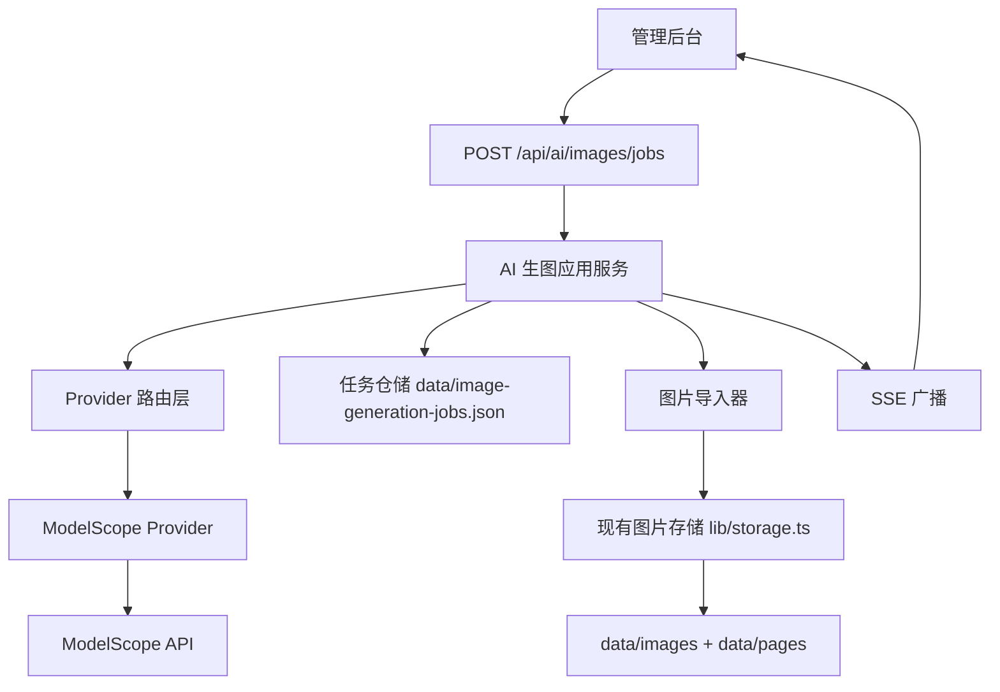
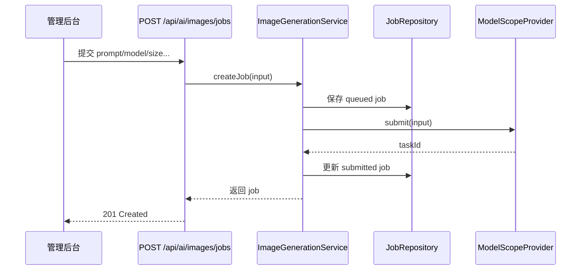
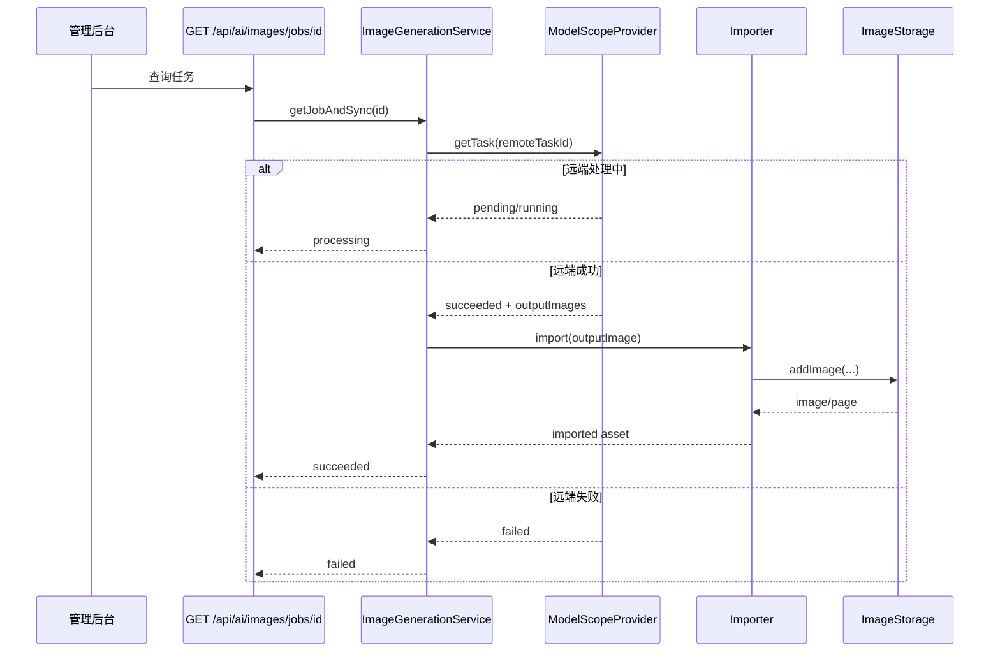

# AI 生图架构

## 目标

为当前服务增加一层统一的 AI 生图能力，采用任务制设计，对上提供稳定的生图业务接口，对下适配不同的生图 Provider。

第一阶段只接入魔搭（ModelScope）API，但整体架构不绑定魔搭，后续应可以平滑增加其他 Provider。

本方案的核心目标：

- 统一抽象生图任务，而不是把前端直接耦合到某个第三方接口
- 让生成结果最终回收到当前服务自己的图片资产库
- 复用现有的图片管理、SSE 推送、OpenAPI、文件存储能力
- 避免依赖进程内定时器，保证任务状态在页面刷新、服务重启后仍可恢复

## 设计背景

当前仓库已经具备三类可复用基础设施：

- 图片存储与展示页生成：`lib/storage.ts`
- 图片访问与管理 API：`app/api/images/route.ts`、`app/api/images/[id]/route.ts`
- 实时推送：`lib/sse.ts`、`app/api/sse/route.ts`

当前仓库也已经有一套 AI HTML 生成功能：

- HTML 生成 API：`app/api/ai/generate/route.ts`
- HTML 生成配置与请求封装：`lib/ai.ts`

因此，AI 生图能力不应当以“单独的新系统”来建设，而应当作为当前服务中的一个新领域能力，挂接到现有的图片资产链路上。

## 参考依据

本方案基于以下资料整理：

- 魔搭 API-Inference 文档：`https://www.modelscope.cn/docs/model-service/API-Inference/intro`
- 仓库内参考文档：`docs/ai生图参考文档/魔搭生图模型文档.md`
- 魔搭官方 `modelscope-mcp-server` 的生图实现

从这些资料可以确认当前魔搭生图接口的关键事实：

- 生图提交接口为 `POST /v1/images/generations`
- 需要通过请求头 `X-ModelScope-Async-Mode: true` 以异步任务方式提交
- 成功提交后返回 `task_id`
- 需要通过 `GET /v1/tasks/{task_id}` 轮询结果
- 查询任务时需要请求头 `X-ModelScope-Task-Type: image_generation`
- 成功结果包含 `output_images`

这决定了本项目内部也必须引入“本地任务”概念，不能把生图流程设计成一个长连接阻塞等待的同步接口。

## 设计原则

- Provider 无关：业务层只依赖统一接口，不感知魔搭特有字段
- 任务优先：先创建本地任务，再与远端任务绑定
- 持久化优先：任务状态落盘，不依赖进程内内存
- 结果资产化：远端生成图必须导入本地图库，不直接依赖第三方临时 URL
- 渐进演进：第一阶段先完成文生图，图生图、LoRA、更多参数在后续扩展
- 强类型：全链路 TypeScript + Zod，禁止 `any`

## 总体架构



建议把 AI 生图拆为四层：

1. API 层
2. 应用服务层
3. Provider 适配层
4. 持久化与资产导入层

### 一、API 层

职责：

- 接收前端请求
- 做认证与参数校验
- 调用应用服务
- 返回标准化任务响应

建议路由：

- `app/api/ai/images/jobs/route.ts`
- `app/api/ai/images/jobs/[id]/route.ts`
- `app/api/ai/images/jobs/[id]/cancel/route.ts`

建议接口：

- `POST /api/ai/images/jobs`
  - 创建生图任务
- `GET /api/ai/images/jobs`
  - 查询任务列表
- `GET /api/ai/images/jobs/{id}`
  - 查询单个任务详情，并在需要时同步远端状态
- `POST /api/ai/images/jobs/{id}/cancel`
  - 标记任务取消

第一阶段不建议设计“前端直接等待出图”的同步接口。

### 二、应用服务层

职责：

- 创建本地任务
- 选择 Provider
- 提交远端任务
- 同步远端任务状态
- 成功后导入本地图片资产
- 广播任务状态变更事件

建议目录：

- `lib/ai/image-generation/service.ts`
- `lib/ai/image-generation/task-runner.ts`

服务层应暴露的核心方法：

- `createJob(input)`
- `listJobs(query)`
- `getJob(jobId)`
- `syncJob(jobId)`
- `cancelJob(jobId)`

这里的关键设计点是：`syncJob(jobId)` 应当是幂等的。无论前端轮询多少次，都只能把任务往前推进，不能产生重复导入。

### 三、Provider 适配层

职责：

- 屏蔽第三方 API 差异
- 统一提交、查询、错误映射、模型约束

建议目录：

- `lib/ai/image-generation/providers/types.ts`
- `lib/ai/image-generation/providers/provider-factory.ts`
- `lib/ai/image-generation/providers/modelscope/provider.ts`
- `lib/ai/image-generation/providers/modelscope/client.ts`

建议统一接口：

```ts
export type ImageGenerationProviderName = 'modelscope';

export interface ImageGenerationProvider {
  readonly provider: ImageGenerationProviderName;
  submit(input: ProviderSubmitInput): Promise<ProviderSubmittedTask>;
  getTask(taskId: string): Promise<ProviderTaskSnapshot>;
}
```

建议统一数据结构：

```ts
export interface ProviderSubmitInput {
  model: string;
  prompt: string;
  negativePrompt?: string;
  size?: string;
  seed?: number;
  steps?: number;
  guidance?: number;
  imageUrl?: string;
  loras?: string | Record<string, number>;
}

export interface ProviderSubmittedTask {
  taskId: string;
  raw?: Record<string, unknown>;
}

export interface ProviderTaskSnapshot {
  status: 'pending' | 'running' | 'succeeded' | 'failed';
  outputImages: string[];
  requestId?: string;
  errorMessage?: string;
  raw?: Record<string, unknown>;
}
```

`raw` 字段仅作为调试与审计用途，业务逻辑不得依赖它。

### 四、持久化与资产导入层

职责：

- 保存任务元数据
- 记录本地任务与远端任务映射关系
- 下载远端结果图
- 调用现有图片存储逻辑入库

建议目录：

- `lib/ai/image-generation/repository.ts`
- `lib/ai/image-generation/importer.ts`

建议新增数据文件：

- `data/image-generation-jobs.json`

结果图片不单独设计新的资产目录，直接复用现有 `images` 资产体系。

## 建议目录结构

```text
app/
  api/
    ai/
      generate/
        route.ts
      images/
        jobs/
          route.ts
          [id]/
            route.ts
            cancel/
              route.ts
lib/
  ai.ts
  ai/
    image-generation/
      config.ts
      types.ts
      service.ts
      repository.ts
      importer.ts
      providers/
        types.ts
        provider-factory.ts
        modelscope/
          client.ts
          provider.ts
```

说明：

- 现有 `lib/ai.ts` 可以先继续服务于 HTML 生成功能
- 新增 `lib/ai/image-generation/*`，避免一次性重构现有 HTML AI 流程
- 第二阶段如果要统一 AI 能力，可以再把 `lib/ai.ts` 拆分为 `html-generation` 和公共模块

## 任务模型设计

建议新增 `ImageGenerationJob`：

```ts
export type ImageGenerationProviderName = 'modelscope';

export type ImageGenerationJobStatus =
  | 'queued'
  | 'submitted'
  | 'processing'
  | 'succeeded'
  | 'failed'
  | 'timed_out'
  | 'canceled'
  | 'import_failed';

export interface ImageGenerationJob {
  id: string;
  provider: ImageGenerationProviderName;
  mode: 'text-to-image' | 'image-to-image';
  status: ImageGenerationJobStatus;
  name: string;
  prompt: string;
  negativePrompt: string | null;
  model: string;
  size: string | null;
  seed: number | null;
  steps: number | null;
  guidance: number | null;
  imageUrl: string | null;
  loras: string | Record<string, number> | null;
  remoteTaskId: string | null;
  remoteRequestId: string | null;
  outputImageUrls: string[];
  importedImageId: string | null;
  importedPageId: string | null;
  errorMessage: string | null;
  syncAttempts: number;
  createdAt: string;
  updatedAt: string;
  completedAt: string | null;
}
```

### 状态含义

- `queued`
  - 本地任务已创建，尚未提交远端
- `submitted`
  - 远端任务已创建，已获得 `remoteTaskId`
- `processing`
  - 远端任务处于 `PENDING` 或 `RUNNING`
- `succeeded`
  - 远端成功，且结果图已经成功导入本地图库
- `failed`
  - 远端明确失败
- `timed_out`
  - 远端长时间未完成，超出系统允许同步窗口
- `canceled`
  - 本地已取消，不再继续推动任务
- `import_failed`
  - 远端成功，但结果图下载或本地入库失败

### 远端状态映射

| 魔搭状态 | 本地状态 |
|------|------|
| 未提交 | `queued` |
| 已返回 `task_id` | `submitted` |
| `PENDING` | `processing` |
| `RUNNING` | `processing` |
| `SUCCEED` 且导入成功 | `succeeded` |
| `SUCCEED` 但导入失败 | `import_failed` |
| `FAILED` | `failed` |

## 与现有图片系统的关系

AI 生图的结果不应停留在任务域内，必须进入现有图片资产域。

建议复用现有能力：

- 图片物理落盘：`lib/storage.ts`
- 展示页自动生成：`lib/storage.ts`
- 原图访问：`app/api/images/[id]/route.ts`
- 图片列表查询：`app/api/images/route.ts`

建议对现有 `ImageAsset` 增加可选元数据字段：

```ts
source?: 'upload' | 'ai-generated';
generationJobId?: string | null;
generatorProvider?: 'modelscope' | null;
generatorModel?: string | null;
prompt?: string | null;
negativePrompt?: string | null;
```

这样做的收益：

- 图床列表可以区分上传图与 AI 图
- 后续可以做“根据任务回溯图片来源”
- 删除图片时可以反向定位来源任务

## 提交与同步流程

### 一、创建任务



### 二、轮询任务



## 为什么采用“查询时同步”而不是后台轮询线程

在当前项目里，最稳妥的实现不是启动一个常驻轮询器，而是采用“持久化任务 + 查询时同步”的模式。

原因：

- 当前服务是 Next.js Route Handler 结构，不适合把关键状态推进逻辑只放在进程内定时器中
- 查询时同步更容易适配开发环境、单机部署、容器重启
- 即使任务创建后用户关闭页面，后续重新打开也能继续查询并推进状态

后续如果部署环境稳定，也可以增加两类增强机制：

- 启动时恢复未完成任务
- 定时调度器或外部 Cron 主动调用 `syncJob`

但这些都属于优化项，不应成为第一阶段上线前提。

## Provider 抽象设计

统一 AI 生图层应分离两类模型：

- 业务任务模型
- Provider 远端模型

业务任务模型只关心：

- 要生成什么
- 现在生成到哪一步
- 最终产出了什么本地资产

Provider 远端模型只关心：

- 第三方接口如何提交
- 第三方返回什么状态
- 第三方错误如何翻译

### ModelScope Provider 设计

建议配置文件：

- `MODELSCOPE_API_TOKEN`
- `MODELSCOPE_API_BASE_URL`
- `MODELSCOPE_IMAGE_DEFAULT_MODEL`
- `MODELSCOPE_IMAGE_ALLOWED_MODELS`
- `MODELSCOPE_IMAGE_TIMEOUT_SECONDS`
- `MODELSCOPE_IMAGE_POLL_INTERVAL_MS`
- `MODELSCOPE_IMAGE_MAX_ATTEMPTS`

建议默认值：

- `MODELSCOPE_API_BASE_URL=https://api-inference.modelscope.cn`
- `MODELSCOPE_IMAGE_TIMEOUT_SECONDS=300`
- `MODELSCOPE_IMAGE_POLL_INTERVAL_MS=5000`
- `MODELSCOPE_IMAGE_MAX_ATTEMPTS=60`

建议使用模型白名单，而不是接受前端传入任意模型 ID。

原因：

- 不同模型的参数支持度不完全一致
- 某些模型虽然在模型页可见，但不一定适合当前接入方式
- 白名单可以把业务可用模型范围稳定下来

## 参数设计

第一阶段建议支持的统一参数：

- `name`
- `prompt`
- `negativePrompt`
- `model`
- `size`
- `seed`
- `steps`
- `guidance`
- `imageUrl`

第一阶段建议暂不对外开放或只做预留的参数：

- `loras`
- 多图输出数量
- 高级采样器
- Provider 专属原始参数透传

原因很简单：第一阶段的目标是把统一任务链路打通，而不是把所有底层参数都暴露给前端。

## API 设计

### 创建任务

`POST /api/ai/images/jobs`

请求体建议：

```json
{
  "name": "春季海报",
  "prompt": "A premium spring sale poster, clean layout, realistic flowers",
  "negativePrompt": "blurry, low quality, watermark",
  "model": "Qwen/Qwen-Image",
  "size": "1024x1024",
  "seed": 12345,
  "steps": 30,
  "guidance": 3.5
}
```

返回体建议：

```json
{
  "id": "job_xxx",
  "status": "submitted",
  "provider": "modelscope",
  "remoteTaskId": "task_xxx",
  "createdAt": "2026-04-19T01:00:00.000Z",
  "updatedAt": "2026-04-19T01:00:00.000Z"
}
```

### 查询单个任务

`GET /api/ai/images/jobs/{id}`

返回体建议：

```json
{
  "id": "job_xxx",
  "status": "succeeded",
  "provider": "modelscope",
  "model": "Qwen/Qwen-Image",
  "prompt": "A premium spring sale poster",
  "outputImageUrls": [
    "https://xxx"
  ],
  "importedImageId": "1710000000000-ab12cd",
  "importedPageId": "1710000000000-ef45gh",
  "imageUrl": "/api/images/1710000000000-ab12cd",
  "pageUrl": "/api/pages/1710000000000-ef45gh"
}
```

### 查询任务列表

`GET /api/ai/images/jobs`

建议支持：

- `status`
- `provider`
- `cursor`
- `limit`

第一阶段即使只做简单列表，也应预留分页字段，避免未来任务量变大后重做接口。

## OpenAPI 设计

建议新增 `AI 生图` 标签，并补充以下 Schema：

- `ImageGenerationJob`
- `ImageGenerationJobList`
- `ImageGenerationCreateRequest`
- `ImageGenerationCancelResponse`
- `ImageGenerationStatus`

需要明确的错误场景：

- `400` 参数错误
- `401` 未授权
- `404` 任务不存在
- `409` 任务状态不允许当前操作
- `502` Provider 请求失败
- `504` Provider 超时

## SSE 设计

建议新增事件名：

- `image-generation-changed`

事件载荷建议：

```json
{
  "jobId": "job_xxx",
  "status": "processing",
  "imageId": null,
  "pageId": null,
  "timestamp": 1776531606000
}
```

成功导入图片后可以继续沿用现有图片域事件：

- `content-changed`

这样做的目的是区分：

- 生图任务状态变化
- 图片资产库内容变化

## 持久化设计

建议新增文件：

- `data/image-generation-jobs.json`

结构建议：

```json
{
  "jobs": []
}
```

持久化要求：

- 每次状态迁移都必须更新 `updatedAt`
- 成功、失败、取消必须记录 `completedAt`
- 同一任务结果导入必须具备幂等保护

推荐的幂等策略：

- 如果 `importedImageId` 已存在，则不再重复导入
- 如果 `status` 已是终态，则 `syncJob` 直接返回

## 安全设计

- 魔搭 Token 仅保存在服务端环境变量中
- 前端不可直接访问 Provider Token
- 仅允许已登录管理后台调用 AI 生图接口
- 生成任务的参数应做 Zod 校验
- Provider 原始错误信息需要做脱敏，避免把敏感响应直接透给前端

## 测试设计

根据仓库规范，核心能力必须补测试，使用 `vitest`。

建议测试拆分：

- `__tests__/lib/ai/image-generation/service.test.ts`
  - 创建任务
  - 任务状态推进
  - 成功导入图片
  - 失败与超时
- `__tests__/lib/ai/image-generation/providers/modelscope/provider.test.ts`
  - 请求头与请求体映射
  - 状态映射
  - 错误映射
- `__tests__/app/api/ai/images/jobs.test.ts`
  - 认证校验
  - 参数校验
  - 路由响应结构
- `__tests__/lib/ai/image-generation/repository.test.ts`
  - 落盘读取
  - 幂等更新

验收命令仍应保持一致：

- `pnpm typecheck`
- `pnpm lint`
- `pnpm test`

## 分阶段实施建议

### 第一阶段

- 建立统一任务模型
- 完成 ModelScope Provider 适配
- 完成文生图任务创建与查询
- 成功结果自动导入现有图片库
- 补齐 OpenAPI 与测试

### 第二阶段

- 支持图生图
- 支持任务列表和筛选
- 后台增加 AI 生图管理面板
- 任务状态通过 SSE 实时刷新

### 第三阶段

- 支持更多 Provider
- 支持模型配置管理
- 支持高级参数
- 支持失败重试、任务恢复、定时同步

## 关键结论

这项功能最合理的落地方式，不是“给页面加一个直接调用魔搭的按钮”，而是增加一个统一的 AI 生图层：

- 对外暴露本地任务接口
- 对内通过 Provider 适配不同生图服务
- 对结果统一回收到本地图片资产体系

这样才能保证当前服务后续具备：

- 多 Provider 扩展能力
- 任务可追踪能力
- 结果资产化能力
- 与现有图片管理系统的一致性

这也是当前仓库里可维护性最高、演进成本最低的方案。
