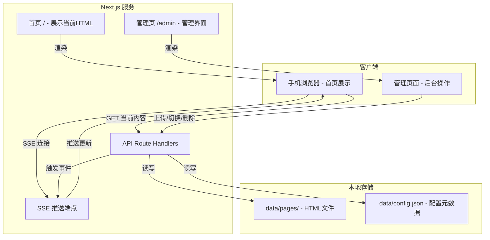
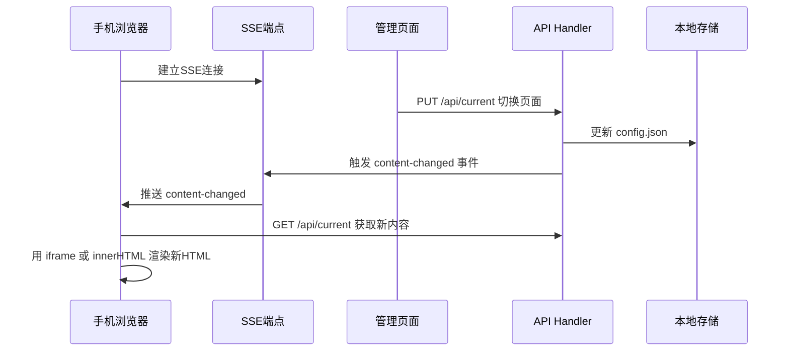

# HTMLPush 项目架构

## 项目目标

做一个 Web 服务，让手机通过浏览器变成一个"桌面显示器"——后台上传/切换 HTML 内容，手机端实时自动更新显示。

核心场景：在管理后台上传 HTML 文件 → 选择当前展示的文件 → 手机浏览器首页自动刷新为最新内容。

## 技术选型

| 层面 | 选择 | 说明 |
|------|------|------|
| 框架 | Next.js 16 (App Router) | 前后端一体，Route Handlers 做 API |
| 前端 | React 19 + Tailwind CSS 4 | 管理页面用 React 组件 |
| 实时通信 | SSE (Server-Sent Events) | 后台切换内容时，手机端自动更新 |
| 数据存储 | 本地文件系统 | HTML 文件存 `data/pages/`，元数据存 `data/config.json` |
| API 规范 | OpenAPI | RESTful 风格接口 |

## 系统架构



## 目录结构

```
htmlpush/
├── app/
│   ├── layout.tsx                    # 根布局
│   ├── page.tsx                      # 首页 - 展示当前HTML内容
│   ├── globals.css
│   ├── admin/
│   │   └── page.tsx                  # 管理页面
│   └── api/
│       ├── pages/
│       │   └── route.ts             # GET 列表 / POST 上传HTML
│       ├── pages/[id]/
│       │   └── route.ts             # GET 详情 / DELETE 删除
│       ├── current/
│       │   └── route.ts             # GET 当前展示 / PUT 切换展示
│       └── sse/
│           └── route.ts             # SSE 实时推送端点
├── lib/
│   ├── storage.ts                    # 文件存储操作封装
│   ├── sse.ts                        # SSE 事件管理器（发布/订阅）
│   └── types.ts                      # 类型定义
├── data/                             # 运行时数据目录（gitignore）
│   ├── pages/                        # 上传的HTML文件
│   └── config.json                   # 元数据：当前展示的页面ID等
└── docs/
    └── 软件架构.md
```

## API 设计

### 页面管理

| 方法 | 路径 | 说明 |
|------|------|------|
| `GET` | `/api/pages` | 获取所有已上传的HTML页面列表 |
| `POST` | `/api/pages` | 上传新的HTML文件（multipart/form-data） |
| `GET` | `/api/pages/[id]` | 获取指定页面的HTML内容 |
| `DELETE` | `/api/pages/[id]` | 删除指定页面 |

### 展示控制

| 方法 | 路径 | 说明 |
|------|------|------|
| `GET` | `/api/current` | 获取当前展示的页面信息 |
| `PUT` | `/api/current` | 切换当前展示的页面（body: `{ pageId: string }`） |

### 实时推送

| 方法 | 路径 | 说明 |
|------|------|------|
| `GET` | `/api/sse` | SSE 连接端点，推送内容变更事件 |

SSE 事件格式：
```
event: content-changed
data: {"pageId": "xxx", "timestamp": 1234567890}
```

## 数据结构

### config.json

```json
{
  "currentPageId": "abc123",
  "pages": [
    {
      "id": "abc123",
      "name": "欢迎页面",
      "filename": "abc123.html",
      "uploadedAt": "2026-04-04T16:00:00Z"
    }
  ]
}
```

## 核心流程

### 实时推送机制

采用 SSE 而非 WebSocket，原因：单向推送场景更简单、HTTP 原生支持、自动重连。



### 首页展示方案

首页使用 `iframe` 嵌入当前 HTML 内容，全屏显示。收到 SSE 事件后自动刷新 iframe 的 src。这样做的好处是：上传的 HTML 完全隔离渲染，不会影响主页面的 SSE 连接和逻辑。

### SSE 事件管理器

在 [`lib/sse.ts`](lib/sse.ts) 中实现一个简单的发布/订阅模式：
- 维护一个 `Set<ReadableStreamDefaultController>` 存储所有活跃的 SSE 连接
- API 切换内容时调用 `broadcast()` 向所有连接推送事件
- 连接断开时自动从 Set 中移除

## 管理页面功能

管理页面 `/admin` 提供以下操作：
- 查看已上传的 HTML 页面列表
- 上传新的 HTML 文件（拖拽或选择文件）
- 预览某个 HTML 页面
- 切换当前展示的页面（一键切换）
- 删除不需要的页面

## 实施步骤

1. 搭建 `data/` 目录结构和 [`lib/storage.ts`](lib/storage.ts) 文件存储层
2. 实现 [`lib/sse.ts`](lib/sse.ts) SSE 事件管理器
3. 实现 API Route Handlers（页面 CRUD + 展示切换 + SSE 端点）
4. 实现首页展示页面（iframe + SSE 客户端监听）
5. 实现管理页面（上传、列表、切换、删除）
6. 添加 `data/` 到 `.gitignore`
