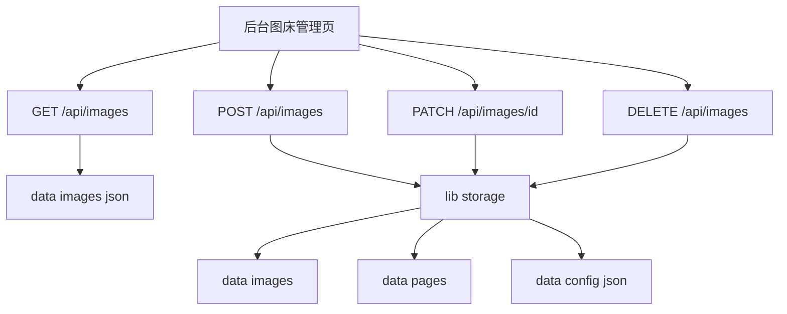

# 图床管理页面方案

## 目标

在现有后台 [`app/admin/page.tsx`](app/admin/page.tsx) 的图片上传能力基础上，补齐一个可运营的图床管理页面。页面重点覆盖：

- 图片列表与缩略图预览
- 按上传时间排序
- 单图重命名
- 批量删除
- 复制图片直链与展示页链接
- 用独立 JSON 文件维护图片索引

当前实现里，图片上传入口在 [`app/admin/page.tsx`](app/admin/page.tsx)，上传 API 在 [`app/api/images/route.ts`](app/api/images/route.ts:8)，图片文件与页面的落盘逻辑在 [`lib/storage.ts`](lib/storage.ts:142)。

## 现状判断

当前图片能力已经具备三个基础点：

1. 上传后可通过 [`app/api/images/[id]/route.ts`](app/api/images/[id]/route.ts:6) 访问原图
2. 上传时会在 [`lib/storage.ts`](lib/storage.ts:159) 自动生成一张图片展示页 HTML
3. 图片元数据当前混存于 [`data/config.json`](data/config.json) 对应的 [`Config.images`](lib/types.ts:15)

当前缺口也很明确：

- 后台没有独立图床管理视图
- 图片元数据缺少名称字段，不支持重命名
- 没有图片列表查询接口
- 没有批量删除接口
- 图片索引与页面配置耦合在同一个配置文件里，后续维护成本偏高

## 方案设计

### 一、后台页面结构

把后台标签从当前 [`type Tab = 'pages' | 'editor' | 'guide' | 'api' | 'prompt'`](app/admin/page.tsx:12) 扩展为包含 `images` 视图。

建议后台结构调整为：

- 页面管理
- **图床管理**
- 编辑器
- 规范
- API
- 提示词

图床管理页面分为三块：

1. 顶部工具栏
   - 上传图片按钮
   - 批量删除按钮
   - 排序切换，仅保留 `最新优先` 与 `最早优先`
   - 已选数量提示

2. 图片网格区
   - 缩略图
   - 图片名称
   - 上传时间
   - 文件格式
   - 文件大小
   - 复制原图链接
   - 复制展示页链接
   - 重命名
   - 删除

3. 侧边预览浮层或弹层
   - 大图预览
   - 原图 URL
   - 展示页 URL
   - 图片 ID
   - 最近更新时间

交互上建议采用**卡片式图片网格**，原因是现有后台为单页管理台，图像资产更适合视觉优先布局，而不是纯表格。

### 二、图片索引 JSON

新增独立索引文件，建议路径：[`data/images.json`](data/images.json)

建议结构：

```json
{
  "images": [
    {
      "id": "1710000000000-ab12cd",
      "name": "春季活动海报",
      "filename": "1710000000000-ab12cd.png",
      "mimeType": "image/png",
      "size": 123456,
      "uploadedAt": "2026-04-16T05:00:00.000Z",
      "updatedAt": "2026-04-16T05:00:00.000Z",
      "pageId": "1710000000000-ab12cd"
    }
  ]
}
```

这里建议把图片索引从 [`Config`](lib/types.ts:15) 中拆出来，原因有三点：

- 页面配置与图片资产是两类生命周期不同的数据
- 批量删除图片时不必频繁读写整站配置
- 后续如果增加回收站、标签、引用统计，独立索引更容易演进

同时建议把 [`ImageAsset`](lib/types.ts:8) 扩展为：

- `name`
- `size`
- `updatedAt`
- `pageId`

### 三、后端接口调整

建议保留现有上传与原图访问能力，同时补齐以下接口：

1. 在 [`app/api/images/route.ts`](app/api/images/route.ts:8)
   - `GET /api/images` 返回图片列表，支持 `sort=uploadedAt-desc|uploadedAt-asc`
   - `POST /api/images` 继续负责上传，但返回字段改为以图片索引为准
   - `DELETE /api/images` 支持批量删除，body 结构为 `{ ids: string[] }`

2. 在 [`app/api/images/[id]/route.ts`](app/api/images/[id]/route.ts:6)
   - 保留 `GET /api/images/[id]` 原图访问
   - 增加 `PATCH /api/images/[id]` 用于重命名，body 结构为 `{ name: string }`
   - 增加 `DELETE /api/images/[id]` 用于单图删除

3. 在存储层 [`lib/storage.ts`](lib/storage.ts)
   - 新增图片索引的读取与保存函数
   - 上传时同步写图片文件、图片索引、展示页
   - 删除时同步删除图片文件、索引记录、关联展示页
   - 重命名时只更新索引，不改物理文件名，避免链接失效

### 五、对外管理 API 与 OpenAPI

既然该服务需要**对外暴露 API 管理图片**，那么图床管理能力不能只停留在后台 UI，还需要把接口设计为稳定的外部契约，并同步维护到 [`docs/openapi.yaml`](docs/openapi.yaml)。

建议把图片相关接口定义为正式公开接口：

- [`GET /api/images`](app/api/images/route.ts:8)
  - 返回图片列表
  - 支持 `sort=uploadedAt-desc|uploadedAt-asc`
  - 支持外部系统拉取图床索引
- [`POST /api/images`](app/api/images/route.ts:8)
  - 上传图片
  - 返回完整图片元数据与关联展示页信息
- `DELETE /api/images`
  - 批量删除图片
  - body: `{ ids: string[] }`
- [`GET /api/images/{id}`](app/api/images/[id]/route.ts:6)
  - 返回原始图片二进制内容
- `PATCH /api/images/{id}`
  - 重命名图片
  - body: `{ name: string }`
- `DELETE /api/images/{id}`
  - 删除单张图片与其关联展示页

为了让外部调用更清晰，建议在 [`docs/openapi.yaml`](docs/openapi.yaml) 新增 `图床管理` 标签，并补充以下模型：

- `ImageAsset`
- `ImageListResponse`
- `ImageUploadResponse`
- `ImageRenameRequest`
- `ImageBatchDeleteRequest`
- `ErrorResponse`

建议对外返回的 `ImageAsset` 结构包含：

```yaml
id: string
name: string
filename: string
mimeType: string
size: integer
uploadedAt: string
updatedAt: string
pageId: string
imageUrl: string
pageUrl: string
```

这样做的价值很直接：

- 后台页面与外部系统复用同一套接口契约
- 后续若接入自动化投放、素材同步、第三方 CMS，不必再次改接口模型
- OpenAPI 文档可直接用于生成 SDK、导入 Apifox 或 Swagger UI

另外建议把图片接口的错误响应统一化，例如：

```json
{
  "error": "图片不存在"
}
```

并在 [`docs/openapi.yaml`](docs/openapi.yaml) 中明确以下错误场景：

- 400 请求参数错误
- 404 图片不存在
- 413 文件过大
- 415 文件类型不支持
- 500 服务端处理失败

### 四、数据流



## 实施拆解

建议按下面顺序落地：

1. 扩展类型定义，拆分图片索引模型，补充 `name`、`size`、`updatedAt`、`pageId`
2. 在 [`lib/storage.ts`](lib/storage.ts) 增加图片索引文件读写能力，并做老数据兼容迁移
3. 补齐图片列表、重命名、单删、批量删除 API
4. 在 [`app/admin/page.tsx`](app/admin/page.tsx) 新增 `images` 标签页与图床管理 UI
5. 增加交互反馈，包括选中态、加载态、复制成功态、删除确认
6. 为图片存储与图片 API 增加 [`vitest`](vitest.config.ts) 测试
7. 更新 [`docs/openapi.yaml`](docs/openapi.yaml)，确保图片管理接口可作为外部调用文档使用

## 风险与约束

需要特别注意两个兼容点：

1. 当前图片元数据还在 [`data/config.json`](data/config.json)，实施时要把旧数据迁移到 [`data/images.json`](data/images.json)
2. 当前 [`deleteImageAsset`](lib/storage.ts:181) 假设页面 ID 与图片 ID 相同，但 [`addImage`](lib/storage.ts:142) 内部是先创建图片 ID，再调用 [`addPage()`](lib/storage.ts:43)，两者实际上**并不保证相同**。所以新方案必须显式保存 `pageId`，否则删除与跳转展示页会存在隐患

## 验收标准

满足以下条件即可认为图床管理页完成：

- 后台存在独立的图床管理标签页
- 能查看所有图片，并按上传时间升降序排序
- 能重命名单张图片，且不影响图片直链
- 能批量删除多张图片及其关联展示页
- 图片索引由独立 JSON 文件维护
- [`docs/openapi.yaml`](docs/openapi.yaml) 已覆盖图片列表、上传、重命名、单删、批量删除、原图访问
- 上传、删除、重命名均有测试覆盖
- 通过 [`pnpm typecheck`](package.json)、[`pnpm lint`](package.json)、[`pnpm test`](package.json)
