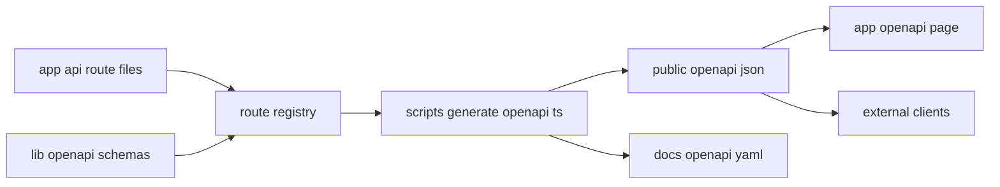

# OpenAPI JSON 自动生成方案

## 目标

把当前手工维护的 [`docs/openapi.yaml`](docs/openapi.yaml) 改造成**派生产物**，让代码注解与 schema 成为唯一事实来源，自动生成：

- [`public/openapi.json`](public/openapi.json)
- [`docs/openapi.yaml`](docs/openapi.yaml)
- 管理后台或独立文档页使用的 API 文档展示数据

## 总体设计

推荐采用**代码优先**方案，核心原则是：

**路由行为、请求响应 schema、OpenAPI 描述，放在同一处声明。**

具体分成四层：

### 一、Schema 层

在 [`lib/openapi/`](lib/openapi) 下集中放 schema 与公共组件定义。

建议目录：

- [`lib/openapi/schemas/`](lib/openapi/schemas)
- [`lib/openapi/registry.ts`](lib/openapi/registry.ts)
- [`lib/openapi/document.ts`](lib/openapi/document.ts)

这里定义：

- 通用错误模型
- [`PageInfo`](lib/types.ts:1) 对应的 API schema
- [`ImageAsset`](lib/types.ts:8) 对应的 API schema
- 各接口请求体、响应体 schema

推荐技术选型：

- `zod`
- `@asteasolutions/zod-to-openapi`

原因很简单：

- 现有项目是 TypeScript，适合 schema-first typed workflow
- 可以让运行时校验和 OpenAPI 复用同一份定义
- 比纯 JSDoc 注释更稳，变更时不容易漂移

### 二、Route 注解层

每个 [`app/api`](app/api) 下的路由文件，只保留两类内容：

- 实际 handler
- 当前接口的 OpenAPI 注册声明

示意结构：

```ts
export const registry = createOpenApiRouteRegistry()

registry.registerPath({
  method: 'get',
  path: '/api/images',
  summary: '获取图片列表',
  ...
})

export async function GET(request: NextRequest) {
  ...
}
```

这样每个接口的文档都紧贴实现文件，例如：

- [`app/api/images/route.ts`](app/api/images/route.ts)
- [`app/api/images/[id]/route.ts`](app/api/images/[id]/route.ts)
- [`app/api/pages/route.ts`](app/api/pages/route.ts)

### 三、文档聚合层

新增一个构建脚本，把所有 route registry 聚合成完整 OpenAPI 文档。

建议新增：

- [`scripts/generate-openapi.ts`](scripts/generate-openapi.ts)

职责：

1. 导入所有 route 的 registry
2. 合并 paths 与 components
3. 注入全局 `info`、`servers`、`tags`
4. 输出 [`public/openapi.json`](public/openapi.json)
5. 同时把 JSON 转成 [`docs/openapi.yaml`](docs/openapi.yaml)

这里的关键结论是：

**JSON 是主产物，YAML 是为了人读和仓库审阅。**

### 四、展示层

提供两个消费方式：

1. 静态文件访问
   - `/openapi.json` 指向 [`public/openapi.json`](public/openapi.json)

2. 文档页面展示
   - 新增 [`app/openapi/page.tsx`](app/openapi/page.tsx) 或后台文档标签页内嵌
   - 使用 Swagger UI / Scalar / Redoc 渲染 [`public/openapi.json`](public/openapi.json)

推荐优先 `Scalar`，原因是界面现代、集成轻、阅读体验比 Swagger UI 更好。

## 推荐目录结构

```text
lib/
  openapi/
    registry.ts
    document.ts
    schemas/
      common.ts
      page.ts
      image.ts

scripts/
  generate-openapi.ts

public/
  openapi.json

docs/
  openapi.yaml
```

## 生成链路



## 实施步骤

### 阶段一：建立基础设施

先引入依赖并建立文档骨架：

- `zod`
- `@asteasolutions/zod-to-openapi`
- `yaml`

然后创建：

- [`lib/openapi/registry.ts`](lib/openapi/registry.ts)
- [`lib/openapi/document.ts`](lib/openapi/document.ts)
- [`scripts/generate-openapi.ts`](scripts/generate-openapi.ts)

### 阶段二：抽离公共 schema

把现在 [`docs/openapi.yaml`](docs/openapi.yaml) 里的核心模型迁移到代码 schema：

- 页面管理模型
- 图床管理模型
- 认证模型
- 通用错误模型

这一步完成后，[`docs/openapi.yaml`](docs/openapi.yaml) 不再手写维护。

### 阶段三：给路由补注解

优先覆盖已有公开 API：

- [`app/api/pages/route.ts`](app/api/pages/route.ts)
- [`app/api/pages/[id]/route.ts`](app/api/pages/[id]/route.ts)
- [`app/api/current/route.ts`](app/api/current/route.ts)
- [`app/api/images/route.ts`](app/api/images/route.ts)
- [`app/api/images/[id]/route.ts`](app/api/images/[id]/route.ts)
- [`app/api/auth/login/route.ts`](app/api/auth/login/route.ts)
- [`app/api/auth/logout/route.ts`](app/api/auth/logout/route.ts)
- [`app/api/auth/check/route.ts`](app/api/auth/check/route.ts)

### 阶段四：接入构建与校验

在 [`package.json`](package.json) 增加脚本：

- `openapi:generate`
- `openapi:check`

推荐流程：

- 本地开发手动执行一次生成
- CI 中执行 `pnpm openapi:generate && git diff --exit-code`

这样可以保证提交的 [`docs/openapi.yaml`](docs/openapi.yaml) 与 [`public/openapi.json`](public/openapi.json) 永远和代码一致。

### 阶段五：接入文档页面

新增一个只读文档页：

- [`app/openapi/page.tsx`](app/openapi/page.tsx)

页面直接加载 [`public/openapi.json`](public/openapi.json) 渲染，外部和内部都使用同一份产物。

## 关键规范

为了让自动生成方案长期可维护，需要定三条规范：

### 1. Schema 统一来源

所有请求体、响应体都必须来自 [`lib/openapi/schemas/`](lib/openapi/schemas) 或同目录导出的复用 schema，禁止在多个 route 里各自写一份匿名 schema。

### 2. 路由注解贴近实现

接口的 `summary`、`description`、`responses` 紧邻对应 handler 文件，避免文档与代码分离。

### 3. YAML 不手改

[`docs/openapi.yaml`](docs/openapi.yaml) 标记为生成文件。任何接口变更，必须改代码注解与 schema，然后重新生成。

## 推荐方案结论

如果你希望**低维护成本**，最稳妥的落地方式是：

**Zod schema + zod-to-openapi + generate 脚本 + public/openapi.json 作为正式产物。**

这比继续手写 [`docs/openapi.yaml`](docs/openapi.yaml) 更稳定，也比纯 JSDoc 注释更适合当前这个 TypeScript 项目。

## 验收标准

满足以下条件即可认为方案完成：

- 新增接口时，只需补 schema 与 route 注解
- 可一键生成 [`public/openapi.json`](public/openapi.json)
- [`docs/openapi.yaml`](docs/openapi.yaml) 由脚本自动派生
- 文档页面读取生成后的 JSON，而不是手写数据
- CI 可以检测 OpenAPI 产物是否过期
